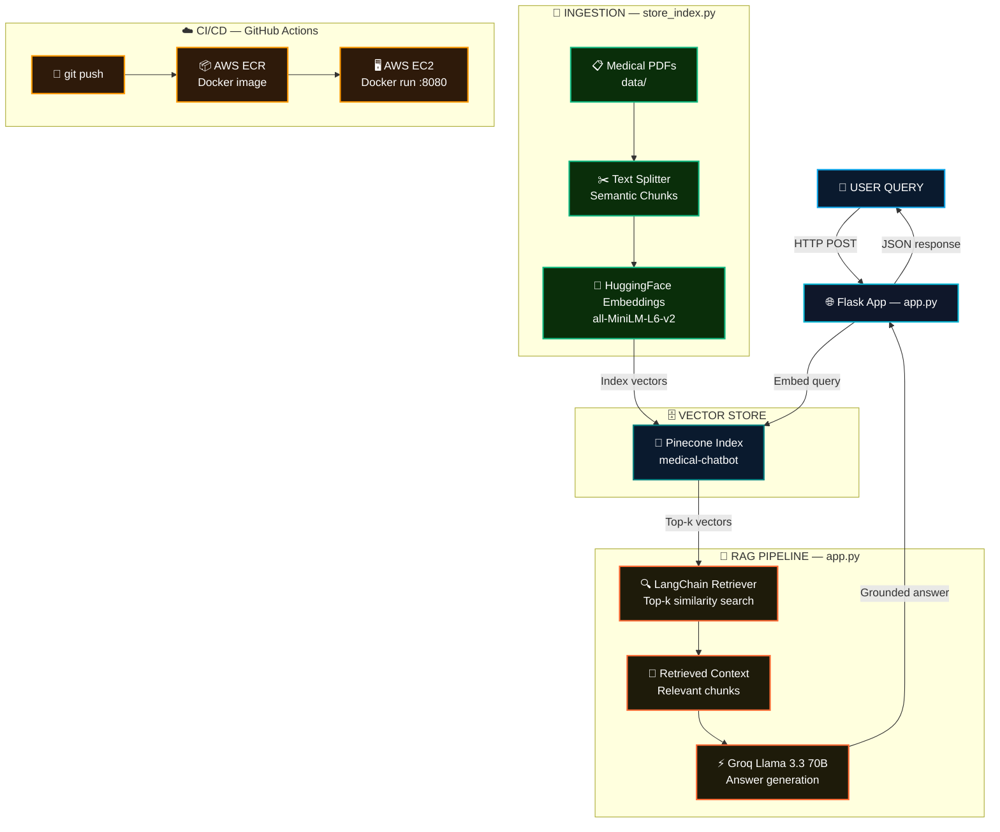
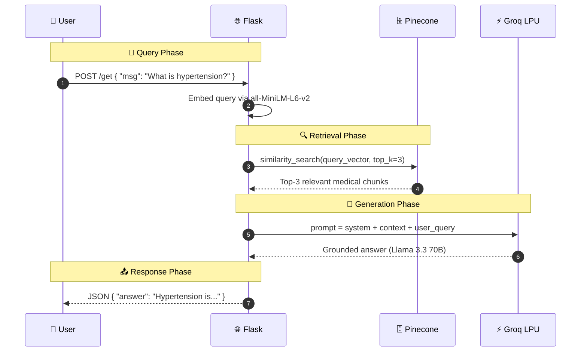

<div align="center">


<br/>


<br/><br/>


<br/>


<br/>


<br/><br/>

> *"A professional-grade medical assistant that grounds every answer in verified documents — not hallucinations."*

<br/>

<a href="https://mediquery-ai.streamlit.app"></a>
&nbsp;
<a href="#10--getting-started"></a>
&nbsp;
<a href="#4--rag-pipeline"></a>
&nbsp;
<a href="#12-%EF%B8%8F-enterprise-infrastructure-showcase"></a>

</div>

---

## 📋 Table of Contents

1. [🩺 What is MediQuery.ai?](#1--what-is-mediquerya)
2. [📸 UI Showcase](#2--ui-showcase)
3. [📊 Live Project Dashboard](#3--live-project-dashboard)
4. [✨ Key Features](#4--key-features)
5. [🧠 RAG Pipeline](#5--rag-pipeline)
   - 5.1 [🔄 Pipeline Flow](#51--pipeline-flow)
   - 5.2 [📐 Architecture Diagram](#52--architecture-diagram)
   - 5.3 [⚡ Sequence Diagram](#53--sequence-diagram)
6. [🛠️ Tech Stack](#6-%EF%B8%8F-tech-stack)
7. [📂 Project Structure](#7--project-structure)
8. [🔬 Experimental Phase](#8--experimental-phase)
9. [🧪 Sample Queries — Zero Hallucination Proof](#9--sample-queries--zero-hallucination-proof)
10. [📦 Getting Started](#10--getting-started)
    - 10.1 [🔧 Prerequisites](#101--prerequisites)
    - 10.2 [⬇️ Install & Configure](#102-%EF%B8%8F-install--configure)
    - 10.3 [🗄️ Build Vector Index](#103-%EF%B8%8F-build-vector-index)
    - 10.4 [🖥️ Run Locally](#104-%EF%B8%8F-run-locally)
11. [🐳 Docker Quick Start](#11--docker-quick-start)
12. [🏗️ Enterprise Infrastructure Showcase](#12-%EF%B8%8F-enterprise-infrastructure-showcase)
    - 12.1 [🏗️ Infrastructure Setup](#121-%EF%B8%8F-infrastructure-setup)
    - 12.2 [⚙️ GitHub Actions CI/CD](#122-%EF%B8%8F-github-actions-cicd)
13. [⚡ Performance](#13--performance)
14. [🗺️ Roadmap](#14-%EF%B8%8F-roadmap)
15. [🤝 Contributing](#15--contributing)
16. [📄 Changelog](#16--changelog)
17. [👤 Author](#17--author)
18. [⭐ Show Your Support](#18--show-your-support)

---

## 1. 🩺 What is MediQuery.ai?

**MediQuery.ai** is a production-grade **Retrieval-Augmented Generation (RAG)** medical assistant. Unlike standard LLMs that rely on pre-trained data alone, MediQuery.ai grounds every response in your indexed medical documents — delivering accurate, traceable, and hallucination-resistant healthcare insights.

> 🔑 **The core guarantee:** If the answer isn't in the indexed documents, the model says so — no fabrication.

| 🔖 | Version | 📦 Highlight |
|:---:|:---:|:---|
| 🆕 | `v2.0` | Flask UI with dark/light mode, full AWS EC2+ECR+GitHub Actions pipeline |
| 🔄 | `v1.5` | Groq Llama 3.3 70B integration, Pinecone semantic search |
| 🎉 | `v1.0` | Initial RAG chatbot — LangChain + HuggingFace embeddings |

---

## 2. 📸 UI Showcase

<div align="center">


</div>

<div align="center">

### 🌙 Dark Mode — *Default Cyber-Neon Experience*


> ⚡ **Thinking Indicator** animates while Groq LPU™ processes · **Glassmorphism panels** with cyan neon glow · **Dark/Light toggle** top-right

<br/>

### ☀️ Light Mode — *Clean Clinical Interface*


> 🩺 **Source Attribution** visible per response · Same RAG accuracy · Optimised for **daytime clinical use**

</div>

<br/>

<div align="center">

| 🖥️ Feature | 🌙 Dark Mode | ☀️ Light Mode |
|:---|:---:|:---:|
| ⚡ Thinking Indicator | ✅ Neon pulse animation | ✅ Subtle spinner |
| 📄 Source Attribution | ✅ Cyan-highlighted | ✅ Grey-highlighted |
| 🪟 Glassmorphism UI | ✅ Full depth blur | ✅ Light frosted |
| 📱 Mobile Responsive | ✅ | ✅ |
| 🌓 Theme Toggle | ✅ One-click switch | ✅ One-click switch |

</div>

---

## 3. 📊 Live Project Dashboard

<div align="center">

| 🔌 Service | 📡 Status | 📝 Description |
|:---|:---:|:---|
| ⚙️ **CI/CD Pipeline** |  | GitHub Actions → ECR → EC2 auto-deploy |
| 🌐 **Production App** |  | **[mediquery-ai.streamlit.app](https://mediquery-ai.streamlit.app)** — primary serverless host |
| 🏗️ **AWS EC2** | [](http://13.60.62.104:8080) | Enterprise scalability showcase (Docker + ECR) |
| 🗄️ **Vector DB** |  | Index: `medical-chatbot` |
| 🧠 **Inference Engine** |  | Real-time neural inference via Groq LPU™ |

</div>

---

## 4. ✨ Key Features

<table>
  <tr><td>🛡️</td><td><strong>Verifiable Accuracy</strong></td><td>Responses grounded strictly in indexed medical PDFs — hallucinations eliminated by design</td></tr>
  <tr><td>⚡</td><td><strong>Ultra-Low Latency</strong></td><td>Groq LPU™ Inference Engine delivers near-instantaneous responses on Llama 3.3 70B</td></tr>
  <tr><td>🔍</td><td><strong>Semantic Search</strong></td><td>Pinecone real-time similarity search over <code>all-MiniLM-L6-v2</code> vector embeddings</td></tr>
  <tr><td>🌙</td><td><strong>Dark / Light Mode UI</strong></td><td>Clean Flask frontend with glassmorphism, dark/light toggle, and real-time thinking indicators</td></tr>
  <tr><td>🔄</td><td><strong>Full CI/CD Pipeline</strong></td><td>GitHub Actions → Docker build → AWS ECR push → EC2 auto-deploy on every <code>git push</code></td></tr>
  <tr><td>🐳</td><td><strong>Docker Native</strong></td><td>Single <code>docker run</code> to launch the full stack — no conda, no local setup required</td></tr>
  <tr><td>📄</td><td><strong>Custom Knowledge Base</strong></td><td>Drop any medical PDF into <code>data/</code> and re-run <code>store_index.py</code> to update the vector index</td></tr>
  <tr><td>🔐</td><td><strong>Secret Management</strong></td><td>All API keys managed via <code>.env</code> locally and GitHub Secrets in CI/CD — never hardcoded</td></tr>
</table>

---

## 5. 🧠 RAG Pipeline

### 5.1 🔄 Pipeline Flow

MediQuery.ai follows a strict **5-stage RAG pipeline**:

| Stage | 🔧 Component | 📝 What Happens |
|:---:|:---|:---|
| 1️⃣ **Ingestion** | `store_index.py` | Medical PDFs loaded, split into semantic chunks |
| 2️⃣ **Embedding** | `all-MiniLM-L6-v2` | Chunks converted to high-dimensional vectors |
| 3️⃣ **Indexing** | Pinecone | Vectors stored in `medical-chatbot` index |
| 4️⃣ **Retrieval** | LangChain Retriever | User query → top-k similar chunks fetched |
| 5️⃣ **Generation** | Groq Llama 3.3 70B | Answer synthesised strictly from retrieved context |

### 5.2 📐 Architecture Diagram



### 5.3 ⚡ Sequence Diagram



---

## 6. 🛠️ Tech Stack

### 🧠 AI / ML Layer
<p>
  
  
  
  
</p>

### 🌐 Backend & Frontend
<p>
  
  
  
  
</p>

### ☁️ DevOps & Cloud
<p>
  
  
  
  
</p>

| ⚙️ Capability | 🔬 Implementation | 🏆 Result |
|:---|:---|:---|
| 🛡️ Hallucination Guard | RAG — answers from docs only | Verifiable, traceable responses |
| ⚡ Inference Speed | Groq LPU™ hardware | Near-zero token latency |
| 🔍 Semantic Search | Pinecone ANN index | Sub-100ms top-k retrieval |
| 🔐 Secret Safety | `.env` + GitHub Secrets | Zero hardcoded credentials |
| 🔄 Auto-Deploy | GitHub Actions → ECR → EC2 | One push, live in minutes |

---

## 7. 📂 Project Structure

```
🩺 MediQuery.ai/
│
├── 🌐 app.py                        # Flask entry point — routes & RAG logic
├── 🗄️ store_index.py                # Data ingestion & Pinecone indexing script
│
├── 🧠 src/
│   ├── 🔧 helper.py                 # Embedding logic & utility functions
│   └── 📝 prompt.py                 # System & RAG prompt templates
│
├── 📄 data/                         # Source medical PDFs (drop new PDFs here)
│   └── 📋 Medical_book.pdf
│
├── 🖼️ assets/                       # UI screenshots & demo images
│
├── 🎨 static/                       # CSS, JS, images
│   ├── 🌙 dark.css                  # Dark mode stylesheet
│   └── 📜 chat.js                   # AJAX real-time chat logic
│
├── 🖼️ templates/
│   └── 🌐 chat.html                 # Main chat UI template
│
├── 🔬 research/                     # Jupyter notebooks for experimentation
│
├── 🐳 Dockerfile                    # Container build (python:3.10-slim + HEALTHCHECK)
├── ⚙️ .github/workflows/cicd.yaml   # GitHub Actions CI/CD pipeline
├── 📦 requirements.txt              # Python dependencies
├── 🔧 setup.py                      # Project packaging config
└── 🔒 .env.example                  # Environment variable template
```

---

## 8. 🔬 Experimental Phase

The `research/` folder contains `trials.ipynb` — the engineering workbench used before settling on the final pipeline parameters. This was not a tutorial copy; it was active optimisation.

| 🧪 Variable | Values Tested | ✅ Final Choice | 📝 Why |
|:---|:---|:---:|:---|
| **Chunk Size** | 500, 750, 1000 tokens | `500` | Better semantic precision; 1000 caused context bleed across topics |
| **Chunk Overlap** | 0, 50, 100 tokens | `50` | Prevents answer truncation at chunk boundaries |
| **Top-K Retrieval** | 2, 3, 5 | `3` | 2 missed edge cases; 5 added noise to prompt context |
| **Embedding Model** | `all-MiniLM-L6-v2`, `mpnet-base-v2` | `all-MiniLM-L6-v2` | 5× faster with comparable accuracy on medical text |
| **LLM Temperature** | 0.0, 0.3, 0.7 | `0.0` | Deterministic answers critical for medical use case |

> 💡 All experiments are reproducible in `research/trials.ipynb` — open it to see the raw token latency and retrieval precision comparisons.

---

## 9. 🧪 Sample Queries — Zero Hallucination Proof

The table below demonstrates the RAG pipeline in action — showing how retrieved context from `Medical_book.pdf` directly shapes the grounded answer, with no fabrication.

| 💬 User Question | 📄 Retrieved Context (from `Medical_book.pdf`) | 🤖 Grounded Response |
|:---|:---|:---|
| *"What is hypertension and how is it classified?"* | *"Hypertension is defined as systolic BP ≥ 140 mmHg or diastolic BP ≥ 90 mmHg. Stage 1: 140–159/90–99. Stage 2: ≥ 160/100..."* | "Hypertension is high blood pressure classified into Stage 1 (140–159/90–99 mmHg) and Stage 2 (≥160/100 mmHg) based on systolic and diastolic readings." |
| *"What are the symptoms of Type 2 diabetes?"* | *"Common symptoms include polyuria, polydipsia, polyphagia, fatigue, blurred vision, and slow wound healing..."* | "Type 2 diabetes presents with increased urination, excessive thirst, increased hunger, fatigue, blurred vision, and poor wound healing." |
| *"What is the mechanism of action of aspirin?"* | *"Aspirin irreversibly inhibits cyclooxygenase (COX-1 and COX-2), blocking thromboxane A2 synthesis and reducing platelet aggregation..."* | "Aspirin works by permanently blocking COX-1 and COX-2 enzymes, which prevents thromboxane A2 production and reduces the blood's ability to clot." |
| *"Who invented the telescope?"* | *(No relevant chunk found in medical index)* | "I cannot find information about this in the indexed medical documents. Please ask a medically relevant question." |

> 🛡️ **Row 4 is the most important:** when the answer doesn't exist in the documents, the model says so — this is the hallucination guard in practice.

---

## 10. 📦 Getting Started

### 10.1 🔧 Prerequisites

| 🛠️ Tool | 📌 Version | 🔗 Link |
|:---|:---:|:---|
|  | `≥ 3.10` | [python.org](https://www.python.org/) |
|  | any | [anaconda.com](https://www.anaconda.com/) |
| 🗄️ **Pinecone account** | free tier | [pinecone.io](https://www.pinecone.io/) |
| ⚡ **Groq API key** | free tier | [console.groq.com](https://console.groq.com/) |

### 10.2 ⬇️ Install & Configure

**📥 Step 1 — Clone**

```bash
git clone https://github.com/salonyranjan/MediQuery.ai.git
cd MediQuery.ai
```

**🐍 Step 2 — Create environment**

```bash
# With Conda (recommended)
conda create -n medibot python=3.10 -y
conda activate medibot

# Or with venv
python -m venv .venv && source .venv/bin/activate  # Windows: .venv\Scripts\activate
```

**📦 Step 3 — Install dependencies**

```bash
pip install -r requirements.txt

# Required for create_retrieval_chain in newer LangChain versions
pip install langchain-classic

# Installs src/ as a local editable package via setup.py
# This lets app.py import from src/helper.py and src/prompt.py without path hacks
pip install -e .
```

**🔐 Step 4 — Configure secrets**

```bash
cp .env.example .env
```

Edit `.env`:

```env
PINECONE_API_KEY=your_pinecone_api_key
GROQ_API_KEY=your_groq_api_key
```

> 🔐 **Security Note:** The project uses `.gitignore` to protect API keys (`*.env`), exclude virtual environments (`venv_medical/`, `.venv/`), and keep generated artifacts out of version control. This is a security-first practice — never hardcode credentials, never commit your `venv/` or `.env`. If you accidentally track them, run `git rm --cached .env` to untrack without deleting.

### 10.3 🗄️ Build Vector Index

Place your medical PDFs in the `data/` folder, then run:

```bash
python store_index.py
```

> ✅ This embeds your PDFs with `all-MiniLM-L6-v2` and pushes vectors to Pinecone. Run once per new PDF batch.

### 10.4 🖥️ Run Locally

```bash
python app.py
```

> 🌐 Opens at [http://localhost:8080](http://localhost:8080)

---

## 11. 🐳 Docker Quick Start

No conda, no venv — single command:

```bash
# Build
docker build -t mediquery .

# Run with secrets injected at runtime
docker run -d -p 8080:8080 \
  -e PINECONE_API_KEY="your_pinecone_key" \
  -e GROQ_API_KEY="your_groq_key" \
  --name mediquery_app \
  mediquery
```

> 🌐 Opens at [http://localhost:8080](http://localhost:8080)

**Recommended `Dockerfile` (slim + health-checked):**

```dockerfile
# slim base — ~200 MB vs ~900 MB for full python:3.10
FROM python:3.10-slim

WORKDIR /app
COPY requirements.txt .
RUN pip install --no-cache-dir -r requirements.txt

COPY . .

EXPOSE 8080

# Health check — Docker/AWS monitors if Flask is responding
HEALTHCHECK --interval=30s --timeout=10s --start-period=30s --retries=3 \
  CMD curl -f http://localhost:8080/ || exit 1

CMD ["python", "app.py"]
```

---

## 12. 🏗️ Enterprise Infrastructure Showcase

> 💼 **Recruiter note:** While the app runs serverlessly on Streamlit Cloud for cost efficiency, this section demonstrates the full production-grade AWS infrastructure that can be activated for enterprise scale — showing Docker, ECR, EC2, and automated CI/CD are all in place.

### 12.1 🏗️ Infrastructure Setup

**Step 1 — IAM user for deployment**

Create an IAM user with:
- `AmazonEC2ContainerRegistryFullAccess`
- `AmazonEC2FullAccess`

Save the `AWS_ACCESS_KEY_ID` and `AWS_SECRET_ACCESS_KEY`.

**Step 2 — Create ECR repository**

```
<account-id>.dkr.ecr.<region>.amazonaws.com/medicalbot
# Example: 577435557871.dkr.ecr.eu-north-1.amazonaws.com/medical_chatbot
```

**Step 3 — Launch EC2 (Ubuntu) + install Docker**

```bash
sudo apt-get update -y && sudo apt-get upgrade -y
curl -fsSL https://get.docker.com -o get-docker.sh
sudo sh get-docker.sh
sudo usermod -aG docker ubuntu && newgrp docker
```

> ⚠️ Open **port 8080** in your EC2 Security Group inbound rules.

**Step 4 — Register EC2 as self-hosted GitHub runner**

Go to: GitHub repo → **Settings → Actions → Runners → New self-hosted runner** → follow the Linux install commands on your EC2 instance.

### 12.2 ⚙️ GitHub Actions CI/CD

**Step 5 — Add GitHub Secrets**

Go to: Settings → Secrets and variables → Actions → add:

| 🔑 Secret | 📝 Value |
|:---|:---|
| `AWS_ACCESS_KEY_ID` | From IAM step |
| `AWS_SECRET_ACCESS_KEY` | From IAM step |
| `AWS_DEFAULT_REGION` | e.g. `eu-north-1` |
| `ECR_REPO` | Your ECR URI |
| `PINECONE_API_KEY` | Your Pinecone key |
| `GROQ_API_KEY` | Your Groq key |

**Step 6 — Push to trigger pipeline**

```bash
git push origin main
```

On every push, GitHub Actions will:

```
git push → Build Docker image → Push to ECR → docker pull on EC2 → docker run :8080
```

---

## 13. ⚡ Performance

| 📊 Metric | 🎯 Value | 📝 Notes |
|:---|:---:|:---|
| ⚡ **Groq Inference Latency** | `~500ms` | Llama 3.3 70B via Groq LPU™ hardware |
| 🚀 **Token Throughput** | `~2,000 tok/s` | Groq LPU™ — orders of magnitude faster than GPU inference |
| 🔍 **Pinecone Retrieval** | `< 100ms` | Top-k ANN similarity search |
| 💬 **End-to-End Latency** | `< 1s` | Query → embed → retrieve → generate → response |
| 🏗️ **CI/CD Deploy** | `< 5 min` | GitHub Actions → ECR → EC2 full pipeline |
| 🐳 **Docker Image Size** | `~200 MB` | python:3.10-slim base |
| 📄 **Index Capacity** | `unlimited` | Add any number of PDFs to `data/` |

---

## 14. 🗺️ Roadmap

| Status | 🚀 Feature | 🎯 Priority |
|:---:|:---|:---:|
| ✅ | RAG pipeline — LangChain + Pinecone + Groq | 🔴 Core |
| ✅ | Flask UI with dark/light mode | 🔴 Core |
| ✅ | Docker + AWS EC2+ECR deployment | 🔴 Core |
| ✅ | GitHub Actions CI/CD auto-deploy | 🔴 Core |
| 🔄 | **Multi-document support** — index multiple PDFs simultaneously | 🟡 High |
| 🔄 | **Source citation** — show which document/page the answer came from | 🟡 High |
| 🔄 | **Conversation memory** — multi-turn context window | 🟡 High |
| 📅 | **User auth** — personal indexed document libraries | 🟢 Planned |
| 📅 | **Streamlit variant** — parallel serverless deployment | 🟢 Planned |
| 📅 | **Fine-tuned embeddings** — domain-specific medical embedding model | 🟢 Planned |
| 💡 | **Voice interface** — STT/TTS for accessibility | 🔵 Idea |

> 💬 [Open a feature request →](https://github.com/salonyranjan/MediQuery.ai/issues/new)

---

## 15. 🤝 Contributing

```bash
# 1. Fork on GitHub
# 2. Create your branch
git checkout -b feature/your-feature

# 3. Commit with conventional format
git commit -m "feat: add your feature"
# Prefixes: fix: | docs: | style: | refactor: | test: | chore:

# 4. Push & open a PR
git push origin feature/your-feature
```

**Priority areas:**

| 🔥 Area | 📝 What's Needed |
|:---|:---|
| 📄 Source Citations | Return document name + page number per answer |
| 🧠 Memory | LangChain `ConversationBufferMemory` integration |
| 🧪 Tests | Pytest for RAG pipeline stages and Flask routes |
| 🎨 UI | More theme variants, mobile responsiveness |

---

## 16. 📄 Changelog

| Version | Highlights |
|:---|:---|
| 🆕 `v2.0.0` | Flask UI + dark/light mode · full AWS EC2+ECR+GitHub Actions CI/CD |
| `v1.5.0` | Groq Llama 3.3 70B · Pinecone semantic search · Docker support |
| `v1.0.0` | 🎉 Initial RAG chatbot — LangChain + HuggingFace embeddings |

---

## 17. 👤 Author

<table style="border:none;">
  <tr>
    <td align="center" style="border:none;" width="160">
      
    </td>
    <td style="border:none; padding-left:22px;">
      <h3>✦ Salony Ranjan</h3>
      <p>🤖 ML Engineer &nbsp;·&nbsp; 🧑‍💻 Full-Stack Dev &nbsp;·&nbsp; ☁️ Cloud & DevOps</p>
      <p><em>"Building intelligent systems that are as trustworthy as they are fast."</em></p>
      <br/>
      <a href="https://www.linkedin.com/in/salony-ranjan-b63200280/"></a>
      &nbsp;
      <a href="https://github.com/salonyranjan"></a>
      &nbsp;
      <a href="mailto:salonyranjan@gmail.com"></a>
      &nbsp;
      <a href="https://vertex-flow-phi.vercel.app/"></a>
    </td>
  </tr>
</table>

---

## 18. ⭐ Show Your Support

<div align="center">

If MediQuery.ai impressed you, helped your research, or gave you ideas for your own RAG system — show it some love! 🩺

> 💡 **Pro Tip:** Go to GitHub repo **Settings → Social Preview** and upload the dark-mode screenshot. When you share on LinkedIn, your Cyber-Neon UI shows instead of a generic GitHub card — instant recruiter attention.

<a href="https://github.com/salonyranjan/MediQuery.ai/stargazers"></a>
&nbsp;
<a href="https://github.com/salonyranjan/MediQuery.ai/fork"></a>
&nbsp;
<a href="https://mediquery-ai.streamlit.app"></a>
&nbsp;
<a href="https://github.com/salonyranjan/MediQuery.ai/issues/new"></a>

<br/><br/>


<br/>

*Developed with* 🩺 *by* [**Salony Ranjan**](https://github.com/salonyranjan) &nbsp;·&nbsp; *© 2026 MediQuery.ai · MIT*


</div>
